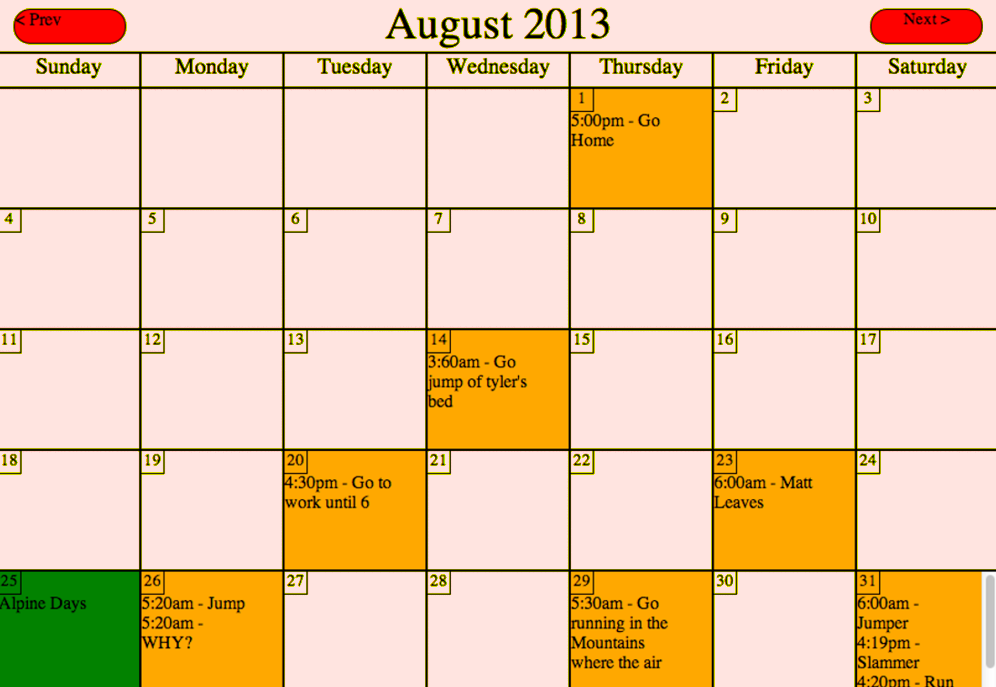

# Calendar - (“Capstone” Project)

### Code

- PHP
- HTML
- CSS
- JQuery

## Proficiency Target

4 to 6 hours. The idea is that you complete this project from scratch within the 4 to 6 hour window. This might mean that you need to complete it multiple times in order to pass it off.

### Requirements

- Create a dynamic calendar with which you can go between months, set appointments, and see major holidays (1 or 2 per month is good for the holidays)
- This calendar should be a month by month view. Don’t worry about making a weekly or daily view.
- When a day is a holiday, change the color
- When there’s an appointment on a day change it to a different color than the holiday
- Only one page load. Once you are into the calendar you can’t reload the page. Use ajax and javascript or jquery to manipulate the calendar once you’re in.
- Have a login which, once the user is logged in, allows them to see their appointments.
- Store the appointments in the database
